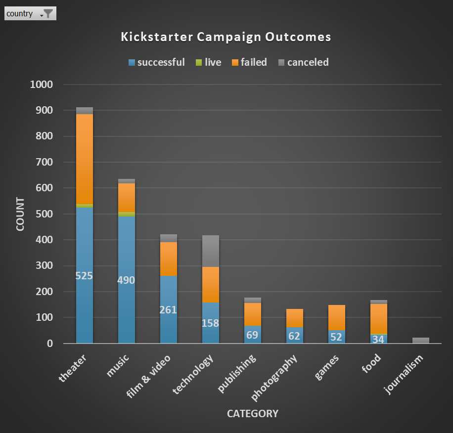

# excel

**Background**

Over $2 billion has been raised using the massively successful crowdfunding service, Kickstarter, but not every project has found success. Of the more than 300,000 projects launched on Kickstarter, only a third have made it through the funding process with a positive outcome.

Getting funded on Kickstarter requires meeting or exceeding the project's initial goal, so many organizations spend months looking through past projects in an attempt to discover some trick for finding success.

**Project**

Modifying and analyzing the data of 4,000 past Kickstarter projects to discover some market trends.

- **Conditional formatting** of state (i.e. campaign status) 

    

- Formula for **percent funded**

        =[@pledged]/[@goal]

- Formula for **average donation** per each backer 

        =IFERROR([@pledged]/[@[backers_count]],"N/A")

- **Split columns** into category and sub-category (*found here:* https://www.howtoexcel.org/tutorials/split-text-by-delimiter)
    
        =LEFT([@[Category and Sub-Category]],FIND("/",[@[Category and Sub-Category]])-1) 

- **Pivot table** to count successful, failed or cancelled campaigns by category 

    

**Trends**

- Using a pivot table to count successful, failed or cancelled campaigns by category create a stacked column pivot chart by **category**, filtered by country. 
    
    

- Using a pivot table to count successful, failed or cancelled campaigns by subcategory create a stacked column pivot chart by **subcategory**, filtered by country.

    

- Convert Unix timestamps to normal dates then create a pivot chart showing the total campaign count by month.

    - Formula for **converting Unix timestamps** to normal dates 
    
            =(((J62/60)/60)/24)+DATE(1970,1,1)

    

    

- Using the COUNTIFS() formula, count how many successful, failed, and canceled projects were created with goals within the goal ranges. 
Create a stacked total line chart that graphs the relationship between a goal's amount and its chances at success, failure, or cancellation.

    

**Statistical Analysis**

|  | Success | Fail | Total | text |
|---| ---| ---| ---| ----|
| Total | 2,185 | 1,530 | 3,715 | overall 59% success rate
| Mean	| 194	| 18    | 113   | sucessful campaigns had a higher average number of backers 
| Median    |	62|	4   | 25 | half of all successful campaigns had more than 62 backers, while half of all failed campaigns has less than 4 backers |
| Minimum   |	1|	0| 0 | only 1 backer is necessary for a successful campaign |
| Maximum   |	26,457|	1,293| 26,457 | every failed campaign had fewer than 1,293 backers
| Variance  |	713,167|	3,776| 388,862 |  
| Standard Deviation | 844 | 61 | 624 | 

**Findings**

- Overall campaign success is associated with lower average goal amounts compared to failed campaigns. 
- Overall campaign failure is associated with lower average number of backers compared to successful campaigns. 

**Conclusion**

- Successful campaigns are more variable across the number of backers which makes sense because high variability indicates higher risk that may be accompanied by higher reward. It seems the failed campaigns adhere to a low variability, i.e. low risk model which leads to low reward.**

**Limitations**

- Missing demographic data.